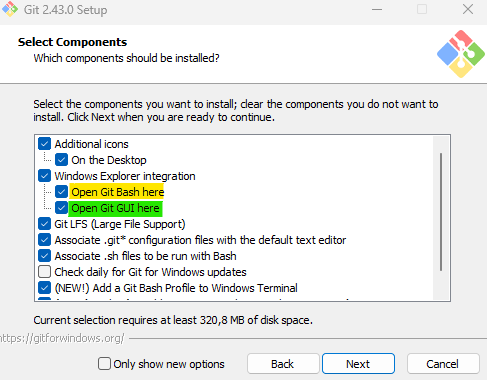
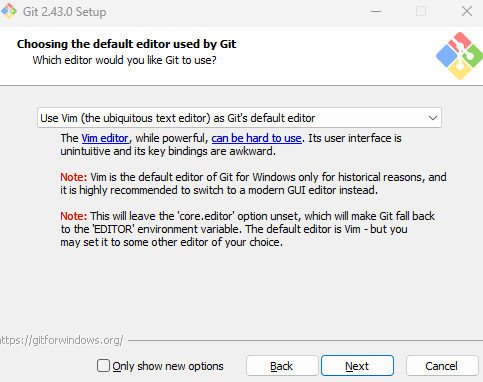

# Primeiros passos com git e github

O intuito deste repositório é orientar de forma prática os novos usuários que se sentem perdidos ao lidar com o git e github e ao inicializar e subir novos repositórios remotamente.


# Sumário 
- [1. Instalar o git](#1.-Instalar-o-git)
    - [1.1 Fazer o download](#11-fazer-o-download-para-a-versão-do-seu-sistema-operacional-no-link-git-downloads)
    - [1.2 Realizando instalação](#12-realizando-a-instalação)
      - [1.2.a Instalação no Windows](#12a---instalando-no-windows)
      - [1.2.b Instalação no Windows](#12b---instalando-no-ubuntu)
- [2. Configurando o Git ](#2.-Configurando-o-Git)
    - [2.1 Configurando o Git no windows](#21---configurando-o-git-no-windows)
    - [2.2 Configurando o Git no Ubuntu](#22---configurando-o-git-no-ubuntu)
- [3. Autenticação via Token](#3-autenticação-via-token)
- [4. Autenticação via SSH](#4-autenticação-via-ssh)
- [5. Criando seu repositório e subindo seu código remotamente.](#5-criando-seu-repositório-e-subindo-seu-código-remotamente)
- [6. Referências](#6-referências)

## 1. Instalar o git

- Ferramenta de versionamento de código.
  
### 1.1. Fazer o download para a versão do seu sistema operacional no link [Git Downloads](https://git-scm.com/downloads)

### 1.2. Realizando a instalação

#### 1.2.a - Instalando no Windows:

Após baixar o executável, irá clicar 2x nele e clicar no botão next, verifique se as caixas " Open Git Bash here" e "Open Git GUI here" estão habilitadas como na imagem abaixo e em seguida next novamente.



Será exibido uma tela perguntando qual editor de texto você prefere usar, aconselho deixar o padrão Vim e futuramente alterar caso achar necessário nas configurações, clique em next.



Agora é só seguir clicando em next por aproximadamente 10x e por último em install e aguardar. 

Pronto, você concluiu a instalação do Git.

#### 1.2.b - Instalando no Ubuntu:

Abra o terminal e verifique se ele já está instalado pois sistemas operacionais Unix costumam já vir com o git instalado por padrão, você pode conferir utilizando o comando `git --version`, você deverá ver o seguinte retorno em sua tela caso esteja instalado.


Caso não esteja instalado você deve executar os comandos `sudo add-apt-repository ppa:git-core/ppa`, pressione enter confirmar e adicionar o ppa e a versão mais estável do git.

Utilize o comando `sudo apt update` para atualizar e por fim `sudo apt install git` para instalar o git.

## 2. Configurando o Git 

Para que essa etapa funcione é necessário possuir uma conta no github.

### 2.1 - Configurando o git no Windows

Na área de trabalho ao clicar com o botão direito irá exibir algumas opções, selecione a opção "Open Git bash here".

Vamos adicionar o usuário através do comando `git config --global user.name "Seu_nome_de_usuario" `.

Em seguida, adicionamos o email que vamos utilizar `git config --global user.email o_mesmo_email_do_@github.com`

### 2.2 - Configurando o git no Ubuntu

Primeiramente vamos abrir o terminal e em seguida digitar o comando `git config --global user.name "Seu_nome_de_usuario" `.

Em seguida, adicionamos o email que vamos utilizar `git config --global user.email o_mesmo_email_do_@github.com`

Obs.: Caso os comandos não executem por falta de permissão (Permission Denied) execute como com a palavra reservada `sudo` antes de cada comando. Ex.: `sudo config --global user.name "nome_do_usuario" `

## 3. Autenticação via Token

Para gerar um token de autorização você deve seguir os seguintes passos:

- Logar na sua conta github;
- Criar um repositório privado;
- Marcar a caixa de opção de add README;
- No canto superior direito onde se encontra sua foto, clique e vá até settings (configurações);
- Desça e clique em developer settings (Configurações de desenvolvedor);
- Personal access tokens
  - Tokens (classic)
    - Generate new token
      - Generate new token (classic)
- Em note insira o nome do token;
- Em "Expiration" selecione o tempo de validade deste token;
- As demais configurações são as permissões que você deseja que o token possua, como baixar ou alterar arquivos no seu repositório;
- Por fim, generate token;
- Copie o token (Após fechar a janela atual este token nunca mais será exibido);
- Abra o Git bash como mencionado no tópico 2 no caso do Windows ou terminal no caso do Ubuntu;
- Execute o comando `git config --global credential.helper store`;
- Execute o comando git clone https://github.com/caminho_do_repositorio_privado
  - Insira seu user.name que foi configurado no git, pressione enter;
  - Insira o token utilizando o comando `CTRL + V`, pressione enter;

## 4. Autenticação via SSH

Para gerar um token de autorização você deve seguir os seguintes passos:
- Obs.: Se preferir, a documentação original [Connecting to GitHub with SSH](https://docs.github.com/pt/authentication/connecting-to-github-with-ssh)
- No Windows abra o git bash / No Ubuntu abra o terminal;
- Digite o comando `ssh-keygen -t ed25519 -C "seu_email@exemplo.com"`, pressione enter;
- Irá pedir uma senha, este campo pode ficar vazio ou digite a senha desejada;
- Com a chave gerada, insira o comando `eval "$(ssh-agent -s)"`;
- Passe o caminho da sua chave privada através do comando `sshd-add ~/.ssh/id_ed25519` e pressione enter;
  - Se você inseriu uma senha, será necessário colocar a senha novamente;
- Agora você deverá logar na sua conta github;
- No canto superior direito onde se encontra sua foto, clique e vá até settings (configurações);
- Selecione SSH and GPG keys;
- Selecione New SSH key;
- Em Title, coloque o nome da sua chave, como por exemplo (DESKTOP-SSH-KEY);
- Em key type, mantenha a opção `Authentication Key`;
- No Windows abra o git bash / No Ubuntu abra o terminal;
- digite o comando `cat ~/.ssh/id_ed25519.pub`, selecione e copie saída do terminal;
- Cole em Key na sua página do github;
- Por fim Add SSH key;
  - Para testar se está funcionando siga o passo a passo de criar um repositório privado com o arquivo README, dentro do repositório, na opção code, selecione clone e a opção ssh e copie.
  - Execute `git clone "endereço_copiado_do_github".git`
  - Irá perguntar se você possui certeza, digite `yes` e pressione enter.
    - Se colocou senha, irá solicitar senha novamente, caso não tenha colocado irá prosseguir normalmente.

## 5. Criando seu repositório e subindo seu código remotamente.

Para conseguir esses passos é necessário que tenham sido feito as etapas anteriores.

- Vá ao github e crie o seu repositório com o nome e descrições desejados.
- Na opção `code` selecione a opção htpps e copie o endereço.
- No terminal (Ubuntu) ou no Git bash (Windows) execute os comandos abaixo para criar e inicializar o repositório:
  - `mkdir nome_do_repositorio`;
  - `cd nome_do_repositorio`
  - `git init`
  - `git add README.md` -> git add irá adicionar os arquivos, `git add .` adiciona todos.
  - `git commit -m "primeiro comentario"` -> Antes de subir um arquivo de código, deve comentar ele.
  - `git branch -M main` -> Seleciona a branch ("ramificação") chamada main.
  - `git remote add origin endereço_https_copiado_do_repositorio.git` -> Adiciona a origem ao repositório.
  - `git push -u origin main` -> Envia o código para o repositório na branch main

Para repositórios existentes e não vinculados existe a opção de vincular e enviar as alterações com os seguintes comandos:

```
git remote add origin endereço_https_copiado_do_repositorio.git -> Adiciona a origem ao repositório.
git branch -M main -> Seleciona a branch "ramificação" chamada main.
git push -u origin main -> Envia o código para o repositório na branch main
```

## 6. Referências

- [Git](https://git-scm.com/docs/git)
- [Github](https://docs.github.com/pt/authentication/connecting-to-github-with-ssh)
